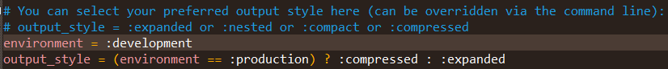

<h1>Compass基本用法</h1>

**目录**  
1. [Compass和Sass](#chapter1)  
2. [安装Compass](#chapter2)  
3. [项目初始化](#chapter3)  
4. [编译](#chapter4)  
5. [Compass的模块](#chapter5)  
6. [Compass的Helper函数](#chapter6)

<h3 id="chapter1">一、Compass和Sass</h3>

之前写了一篇关于[Sass基本用法](http://allenmind.cn/2017/11/26/SASS%E5%B8%B8%E7%94%A8%E8%AF%AD%E6%B3%95/)的文章。Sass可以加快CSS的编写效率，让CSS的开发变得更加简单和可维护。但是，想要发挥Sass的全部功力，就需要配合Compass一起使用。（就好像，下雨天和巧克力更配哟~这样的道理）

Compass是Sass的工具库（Toolkit）。

Sass本身只是一个编译器，Compass是在它的基础上，封装了一系列有用的模板和模块，补充了Sass的功能。它们之间的关系，有点像Javascript和jQuery、Ruby和Rail、python和Django。

<h3 id="chapter2">二、安装Compass</h3>

Compass和Sass一样，同样是Ruby语言开发的，所以，要先安装Ruby。

当安装完Ruby后，现在假设在Windows环境下，只要在命令行输入一下命令，即可安装Compass：

<pre>
gem install compass
</pre>

<h3 id="chapter3">三、项目初始化</h3>

现在我们来创建一个Compass项目，假设项目名称为“learnCompass”，我们在当前目录的命令行输入：

<pre>
compass create learnCompass
</pre>

然后就会看到在当前目录中会出现一个叫learnCompass的文件夹。

里面有3个东西：

* config.rb文件：是项目的配置文件
* sass文件夹：存放Sass源文件
* stylesheet文件夹：存放编译后的css文件

<h3 id="chapter4">四、编译</h3>

当我们写完.scss文件后，需要经过编译，才能生成css文件。现在说一下如何通过Compass来编译.scss文件。

Compass的编译命令是：

<pre>
compass compile
</pre>

这条命令要在 **项目的根目录** 下运行。效果是会将sass文件夹里面的.scss文件，编译成css文件，然后保存在stylesheet文件夹里面。

默认情况下，编译出来的css文件是带有很多的注释。在生产环境中，我们需要的是压缩后的css文件，这时候要使用 `--output-style` 参数。

<pre>
compass compile --output-style compressed
</pre>

Compass只编译 **发生变动的文件** ，如果要重新编译未变动的文件，需要使用 `--force` 参数：

<pre>
compass compile --force
</pre>

除了使用命令行的参数，还可以直接在配置文件（config.rb）中指定编译模式：

<pre>
output_style = :compressed
</pre>

这里的参数和Sass的编译模式一一对应，:nested、:expanded、:compact和:compressed。

另外，可以指定environment的值（:production或:development），智能判断编译模式。

<pre>
environment = :development
output_style = (environment == :production) ? :compressed : :expanded
</pre>

在命令行模式下，除了一次性编译命令，Compass还有自动编译命令：

<pre>
compass watch
</pre>

运行这条命令后，只要.scss文件发生了变化，就会被自动编译成css文件。

更多Compass命令行的用法，请参考[官方文档](http://compass-style.org/help/tutorials/production-css/)

<h3 id="chapter5">五、Compass的模块</h3>

Compass采用模块结构，不同的模块提供不同的功能。目前，Compass内置了5个模块：

* [reset](#chapter5-1)
* [css3](#chapter5-2)
* [layout](#chapter5-3)
* [typography](#chapter5-4)
* [utilities](#chapter5-5)

这5个模块提供了Compass的主要功能。

当然，我们也可以自行加载网上的第三方模块，或者自己动手编写模块。

下面来介绍一下如何使用模块：

> 使用模块的大致方法是：先用@import命令把那个模版加载进来，然后再用@include命令调用模版里面的各种mixin。

<h5 id="chapter5-1">1、reset模版</h5>

这个[reset模版](http://compass-style.org/reference/compass/reset/)编译出来的CSS文件，就是一般用来重置浏览器默认样式的CSS文件（[reset.css](https://meyerweb.com/eric/tools/css/reset/index.html)）。

<pre>
@import "compass/reset";
</pre>

<h5 id="chapter5-2">2、css3模版</h5>

这个模版已经帮你把19种CSS3属性分别写成了19个Mixin，每个Mixin里面写好了各种浏览器前缀和兼容手段。导入模版后，用@include命令调用你想用的属性的Mixin即可。具体各个Mixin的用法请看：[这里](http://compass-style.org/reference/compass/css3/)。

例子1： CSS圆角（border-radius）

<pre>
@import "compass/css3";

.rounded1 {
  @include border-radius(5px);
}

.rounded2 {
  @include border-corner-radius(top, left, 5px);
}
</pre>

编译后的CSS代码为：

<pre>
.rounded1 {
  -moz-border-radius: 5px;
  -webkit-border-radius: 5px;
  border-radius: 5px;
}

.rounded2 {
  -moz-border-radius-topleft: 5px;
  -webkit-border-top-left-radius: 5px;
  border-top-left-radius: 5px;
}
</pre>

例子2：透明（opacity）

<pre>
@import "compass/css3";

#opacity {
 @include opacity(0.5);
}
</pre>

编译后的CSS代码为：

<pre>
#opacity {
  filter: progid:DXImageTransform.Microsoft.Alpha(Opacity=50);
  opacity: 0.5;
}
</pre>

例子3：inline-block

<pre>
@import "compass/css3";

.div-inline {
  @include inline-block;
}
</pre>

编译后的CSS代码为：

<pre>
.div-inline {
  display: inline-block;
  vertical-align: middle;
  *vertical-align: auto;
  *zoom: 1;
  *display: inline;
}
</pre>

<h5 id="chapter5-3">3、layout模版</h5>

[layout模版](http://compass-style.org/reference/compass/layout/)提供了布局功能（目前有3个功能：Grid Background、Sticky Footer 和 Stretching）。

例子：指定子元素占满父元素（Stretching）：

<pre>
@import "compass/layout";

#stretch-full {
  @include stretch;
}
</pre>

<h5 id="chapter5-4">4、typography模版</h5>

[typography模版](http://compass-style.org/reference/compass/typography/)提供了版式功能（链接、列表、文本处理、Vertical Rhythm）。

例如，指定链接（Link）各个状态的颜色的Mixin为：

<pre>
link-colors($normal, $hover, $active, $visited, $focus)
</pre>

使用时写成：

<pre>
@import "compass/typography";
a {
  @include link-colors(#F00, #0F0, #00F, #CCC, #AC0);
}
</pre>

编译后的CSS代码为：

<pre>
a {
  color: #F00;
}

a:visited {
  color: #CCC;
}

a:focus {
  color: #AC0;
}

a:hover {
  color: #0F0;
}

a:active {
  color: #00F;
}

</pre>

<h5 id="chapter5-5">5、utilities模版</h5>

[utilities模版](http://compass-style.org/reference/compass/utilities/)提供某些不属于其他模块的功能。

比如，清除浮动：

<pre>
@import "compass/utilities";

.clearfix{
  @include clearfix;
}
</pre>

<h3 id="chapter6">六、Compass的Helper函数</h3>

Compass提供了一些补充[函数](http://compass-style.org/reference/compass/helpers/)。这些函数可以大大增强Sass的威力。

例如，`image-width()` 和 `image-height()` 可以返回图片的宽和高。

又例如，`inline-image()` 可以将图片转为data协议的数据。

<pre>
@import "compass";

$picWidth: image-width("pic1.png");
$picHeight: image-height("pic1.png");

.pic {
  width: $picWidth;
  height: $picHeight;
}
</pre>

（图片默认放在该compass项目目录里面的images文件夹里面，没有就新建一个）

编译后的CSS代码为：

<pre>
.pic {
  width: 405px;
  height: 540px;
}
</pre>

(本文主要参考[阮一峰老师的文章](http://www.ruanyifeng.com/blog/2012/11/compass.html))