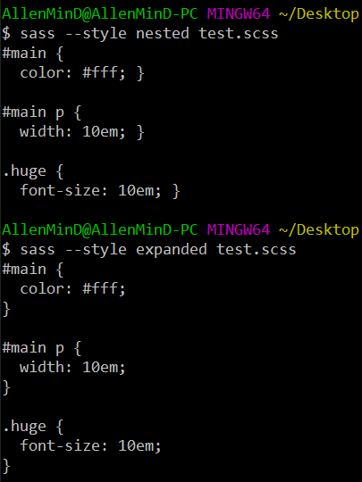
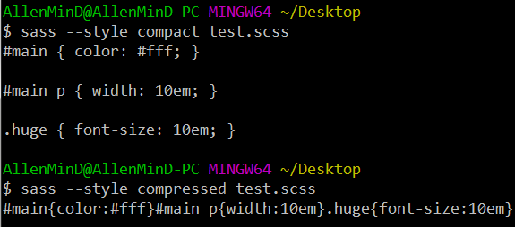

<h1>SASS常用语法</h1>

**目录**  
1. [把SASS文件编译成.css文件](#chapter1)  
2. [SASS基本用法](#chapter2)  
3. [SASS重用代码的方法](#chapter3)  
4. [SASS高级用法](#chapter4)  

我们知道，CSS不是一种编程语言，它没有变量、函数、条件语句、循环语句等，因此，我们在编写CSS的时候，只能一句一句地描述，写多的话会觉得很麻烦。

后来，有人为CSS加入了编程元素，这被叫做“CSS于处理器”。它的基本思想是：用一种专门的编程语言，进行网页样式的设计，然后再编译成CSS文件。

目前常用的CSS于处理器有3种：SASS、LESS和Stylus。本篇文章主要介绍SASS的常用语法。想要看更系统地学习SASS，请参考[官方文档](https://www.sass.hk/docs/)。

<h3 id="chapter1">一、把SASS文件编译成.css文件</h3>

SASS文件就是普通的文本文件，里面可以直接使用CSS语法。后缀名一般是.scss，意思是Sassy CSS。

现在我们打开命令行（cmd，或者git Bash等），切换到SASS文件所在的目录，然后运行下面命令，就可以把.scss文件转化为css代码。（现在假设文件名为test）

<pre>
  sass test.scss
</pre>

如果想要保存为css文件，就运行下面的代码：

<pre>
  sass test.scss test.css
</pre>

（**这里要注意**： 如果编译后出现乱码，记得在原scss文件的开头加上：`@charset "UTF-8";`）

SASS提供4个编译风格的选项：

* `nested`: Nested （嵌套）样式是 Sass 默认的输出格式，能够清晰反映 CSS 与 HTML 的结构关系。选择器与属性等单独占用一行，缩进量与 Sass 文件中一致，每行的缩进量反映了其在嵌套规则内的层数。当阅读大型 CSS 文件时，这种样式可以很容易地分析文件的主要结构。
* `expanded`: Expanded 输出更像是手写的样式，选择器、属性等各占用一行，属性根据选择器缩进，而选择器不做任何缩进。
* `compact`: Compact 输出方式比起上面两种占用的空间更少，每条 CSS 规则只占一行，包含其下的所有属性。嵌套过的选择器在输出时没有空行，不嵌套的选择器会输出空白行作为分隔符。
* `compressed`: Compressed 输出方式删除所有无意义的空格、空白行、以及注释，力求将文件体积压缩到最小，同时也会做出其他调整，比如会自动替换占用空间最小的颜色表达方式。

4个编译风格的结果分别如下：

在生产环境中，一般使用最后一个选项：

<pre>
  sass --style compressed test.scss test.css
</pre>

你可以让SASS监听某个文件或目录，一旦源文件有变动，就自动生成编译后的版本。(冒号前面是scss文件（目录），冒号后为编译后的css文件（目录）)

<pre>
// watch a file 
sass --watch test.scss:test.css

// watch a directory
sass --watch app/sass:public/stylesheets
</pre>

<h3 id="chapter2">二、SASS基本用法</h3>

接下来我们来看看SASS的基本用法：[【变量】](#chapter2-1)、[【运算】](#chapter2-2)、[【嵌套】](#chapter2-3)、[【注释】](#chapter2-4)

<h5 id="chapter2-1">1、变量</h5>

SASS可以使用变量，所有变量以 `$` 开头

<pre>
@charset "UTF-8";
$blue : #1875e7;
div {
  color : $blue;
}
</pre>

编译成css文件：

<pre>
div {
  color: #1875e7; }
</pre>

如果变量需要写在字符串中（例如镶嵌在css属性名中），就必须写在 `#{}` 当中。

<pre>
$side: top;

p {
  margin-#{$side}: 10px;
  border-#{$side}-left-radius: 3px;
}
</pre>

编译成CSS文件：

<pre>
p {
  margin-top: 10px;
  border-top-left-radius: 3px; }
</pre>

<h5 id="chapter2-2">2、运算</h5>

SASS允许在代码中使用算数表达式，也就是说，可以通过运算来得到css中属性的值了。

<pre>
$var1: 5;
$var2: 10px;

body {
  margin: (14px/2);
  top: 50px + 100px;
  right: $var1 * 10%;
  left: $var2 * 5;
}
</pre>

编译成CSS文件后：

<pre>
body {
  margin: 7px;
  top: 150px;
  right: 50%; }
</pre>

<h5 id="chapter2-3">3、嵌套</h5>

SASS允许选择器嵌套。例如下面的css代码：

<pre>
div h1 {
  color: red;
}
</pre>

可以写成：

<pre>
div {
  h1 {
    color: red;
  }
}
</pre>

属性也是可以嵌套的，例如border-color属性，可以写成：

<pre>
p {
  border: {
    color: red;
  }
}
</pre>

**注意**，border后面必须加上冒号。

编译成CSS文件后：

<pre>
p {
  border-color: red; }
</pre>

在嵌套的代码块内，可以使用 `&` 来引用父元素，比如a:hover，可以写成：

<pre>
a {
  &:hover {
    color: #1875e7;
  }
}
</pre>

编译成CSS文件后：

<pre>
a:hover {
  color: #1875e7; }
</pre>

上面的 `&` 就代表着 `a`。

<h5 id="chapter2-4">4、注释</h5>

SASS注释有两种风格。

1. 标准的CSS注释 /* comment */ ，会保留到编译后的css文件中。
2. 单行注释 //comment ，只会保存在.scss文件中，编译后会被省略。

在 `/*` 后面加一个感叹号，即 `/*!` ，表示是“重要注释”。即使是compressed模式编译，也会保留这行注释，通常可以用来声明版权信息。

<pre>
/*!
  Copyright by Allenmind
*/
</pre>

<h3 id="chapter3">三、SASS重用代码的方法</h3>

接着来说下SASS中，让代码重用的方法。主要也分4部分：[【继承】](#chapter3-1)、[【Mixin】](#chapter3-2)、[【颜色函数】](#chapter3-3)、[【插入文件】](#chapter3-4)

<h5 id="chapter3-1">1、继承</h5>

SASS允许一个选择器，继承另一个选择器。比如：现在有一个选择器.class1：

<pre>
.class1 {
  border 1px solid #ddd;
}
</pre>

选择器.class2要继承.class1，就要是用 `@extend` 命令：

<pre>
.class2 {
  @extend .class1;
  font-siez: 120%;
}
</pre>

编译后结果为：

<pre>
.class1, .class2 {
  border: 1px solid #ddd; 
}

.class2 {
  font-size: 120%; 
}
</pre>

<h5 id="chapter3-2">2、Mixin</h5>

Mixin有点像C语言的宏，是可以重用的代码块。

使用 `@mixin` 命令，定义一个代码块：

<pre>
@mixin iAmLeft {
  float: left;
  margin-left: 10px;
}
</pre>

使用 `@include` 命令，调用这个mixin：

<pre>
div {
  @include iAmLeft;
}
</pre>

以上两段程序合起来编译成CSS文件后：

<pre>
div {
  float: left;
  margin-left: 10px; }
</pre>

mixin还有一个强大的地方，就是可以指定参数和缺省值：

<pre>
@mixin iAmLeft($value: 10px) {
  float: left;
  margin-right: $value;
}
</pre>

使用的时候，根据需要加入参数（如果不指定参数，将会用定义mixin时参数的默认值，因此，如果在调用mixin（@include）时没有给定参数，在定义mixin时，就**一定要给参数指定默认值**，不然会报错）

<pre>
div {
  @include iAmLeft(30px);
}
</pre>

编译成CSS文件后：

<pre>
div {
  float: left;
  margin-left: 30px; }
</pre>

下面再来一个mixin实例，用来生成浏览器前缀：

<pre>
@mixin  rounder($dir1, $dir2, $value) {
  border-#{$dir1}-#{$dir2}-radius: $value;
  -o-border-#{$dir1}-#{$dir2}-radius: $value;
  -moz-border-#{$dir1}-#{$dir2}-radius: $value;
  -webkit-border-#{$dir1}-#{$dir2}-radius: $value;
}

#navbar li {
  @include rounder(top, left, 5px);
}
</pre>

编译成CSS文件后：

<pre>
#navbar li {
  border-top-left-radius: 5px;
  -o-border-top-left-radius: 5px;
  -moz-border-top-left-radius: 5px;
  -webkit-border-top-left-radius: 5px; }
</pre>

<h5 id="chapter3-3">3、颜色函数</h5>

SASS提供了一些内置的颜色函数，以便生成系列颜色。

<pre>
lighten(#cc3, 10%) // #d6d65c
darken(#cc3, 10%) // #a3a329 
grayscale(#cc3) // #808080
complement(#cc3) //#33c 
</pre>

关于颜色函数更多的细节，请看：[这里](https://www.cnblogs.com/ylliap/p/6094241.html) 和 [这里](https://www.w3cplus.com/preprocessor/sass-color-function.html)

<h5 id="chapter3-4">4、插入文件</h5>

当需要插入外部文件时，用@import命令：

<pre>
@import "path/filename.scss";
</pre>

如果插入的是.css文件，则等同与css的import命令。

<pre>
@import "foo.css";
</pre>

<h3 id="chapter4">四、SASS高级用法</h3>

最后来看看SASS的高级用法。主要有：[【条件语句】](#chapter4-1)、[【循环语句】](#chapter4-2)、[【自定义函数】](#chapter4-3)

<h5 id="chapter4-1">1、条件语句</h5>

`@if` 可以用来判断：

<pre>
p {
  @if 1 + 1 == 2 { border: 1px solid #a30d14; }
  @if 5 < 3 { border: 2px dotted #555; }
}
</pre>

编译成CSS文件后：

<pre>
p {
  border: 1px solid #a30d14; }
</pre>

还配有 `@else` 命令：

<pre>
p {
  @if 1 + 1 > 2 {
    background-color: #000;
  } @else {
    background-color: #fff;
  }
}
</pre>

编译成CSS文件后：

<pre>
p {
  background-color: #fff; }
</pre>

<h5 id="chapter4-2">2、循环语句</h5>

SASS支持for循环，用 `@for` 命令：

<pre>
@for $i from 1 to 4 {
  .border-#{$i} {
    border: #{$i} px;
  }
}
</pre>

编译成CSS文件后：

<pre>
.border-1 {
  border: 1 px; }

.border-2 {
  border: 2 px; }

.border-3 {
  border: 3 px; }
</pre>

SASS也支持while循环，用 `@while` 命令：

<pre>
$i: 6;
@while $i > 0 {
  .item-#{$i} {
    width: 2em * $i;
  }
  $i: $i - 2;
}
</pre>

编译成CSS文件后：

<pre>
.item-6 {
  width: 12em; }

.item-4 {
  width: 8em; }

.item-2 {
  width: 4em; }
</pre>

第三种循环方法是each，用 `@each` 命令：

<pre>
@each $member in a, b, c, d {
  .#{$member} {
    background-image: url("/image/#{$member}.jpg");
  }
}
</pre>

编译成CSS文件后：

<pre>
.a {
  background-image: url("/image/a.jpg"); }

.b {
  background-image: url("/image/b.jpg"); }

.c {
  background-image: url("/image/c.jpg"); }

.d {
  background-image: url("/image/d.jpg"); }
</pre>

<h5 id="chapter4-3">3、自定义函数</h5>

SASS允许自己编写函数，用 `@function` 命令：

<pre>
@function double($n) {
  @return $n * 2;
}

#sidebar {
  width: double(5px);
}
</pre>

编译成CSS文件后：

<pre>
#sidebar {
  width: 10px; }
</pre>