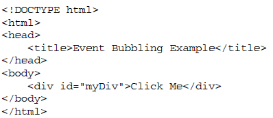
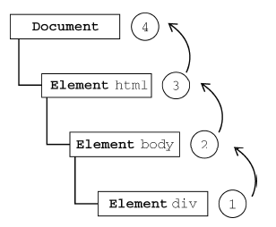
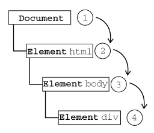
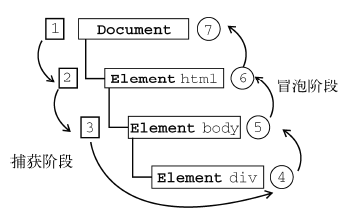
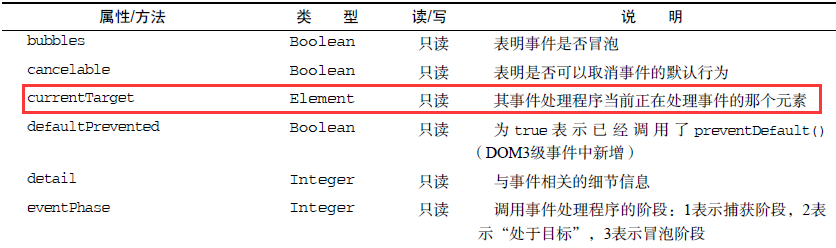
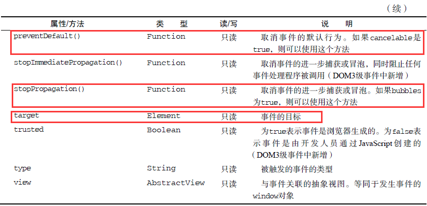
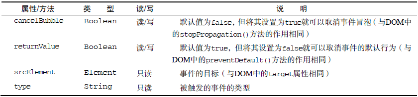

<h1>Javascript事件总结</h1>

**目录**  
0. [前言](#chapter0)  
1. [事件流](#chapter1)  
2. [事件处理程序](#chapter2)  
3. [事件对象event](#chapter3)  
4. [事件类型](#chapter4)  
5. [事件委托](#chapter5)  
6. [模拟事件](#chapter6)  

<h3 id="chapter0">前言</h3>  

Javascript和HTML之间的交互是通过**事件**来实现的。事件，就是文档和浏览器窗口中发生的一些特定的交互瞬间。**可以这样说，基本上只要你打开了网页，事件就开始无时无刻地发生了**：鼠标移动（mousemove）、鼠标点击（click）、键盘按键（keydown）等动作就是事件。一般情况下，网页一开始默认知道这些事件发生了的时候，是没有任何“反应”的，如果想要在某个事件发生的时候有所“反应”，就要为某个事件绑定一个 **监听器（或者叫事件处理程序）**。监听器（事件处理程序）其实就是一个函数，而这个函数要在某个事件发生时才会执行。  

<h3 id="chapter1">一、事件流</h3>  

假设现在有有一个画在白纸上的同心圆，当你把手指放在圆心上时，那么你的手指指向的不只是一个圆，而是纸上 **所有的圆**。同样道理，当我们单击某个按钮的同时，我们也单击了按钮的容器元素，甚至也单击了整个页面。

> **事件流**描述的是从页面中接收事件的顺序。

到目前为止，有3种事件流：冒泡流（IE）、捕获流（Netscape）、DOM事件流

- **【冒泡流】**：IE的事件流叫做事件冒泡（冒泡流），即事件最开始由最具体的元素（文档中嵌套层次最深的那个节点）接收，然后 **逐级向上**传播到较为不具体的节点（文档）。即 **从内到外**。
- **【捕获流】**：Netscape的事件流叫事件捕获（捕获流），与IE的冒泡流正好相反，即事件最开始由不太具体的节点先接收，然后 **逐级向下**传播，直到最具体（最深）的那个节点。即 **从外到内**。（由于老版本的浏览器不支持捕获流，所以很少有人使用捕获流）
- **【DOM事件流】**：“DOM2级事件”规定，事件流包括3个阶段： **事件捕获阶段**、 **处于目标阶段**、 **事件冒泡阶段**。
  + 首先发生的是“事件捕获”阶段，事件流从外“流”到内直至 **目标元素**（真正触发事件的那个元素，例如点击的按钮）；
  + 找（“流”）到目标元素后，就变成了“处于目标”阶段；
  + 然后马上就是“事件冒泡阶段”，即事件流马上“往回流”，从内“流”到外直至最外层的元素。

举个具体的例子吧。

对于上面的代码，当我们单击页面中的`
`元素时，3个不同类型的事件流分别有不同“流”法：

- 对于【冒泡流】，这个click事件会按照如下顺序传播:  
  (1)`
`  
  (2)`<body>`  
  (3)`<html>`  
  (4)`document`  
  图示如下：  
    
- 对于【捕获流】，这个click事件会按照如下顺序传播：  
  (1)`document`  
  (2)`<html>`  
  (3)`<body>`  
  (4)`
`  
  图示如下：  
    
- 对于【“DOM2事件”的事件流】，这个click事件会按照如下顺序传播：  
  (1)`document`  
  (2)`<html>`  
  (3)`<body>`  
  (4)`
`  
  (5)`<body>`  
  (6)`<html>`  
  (7)`document`  
  图示如下：  
    

<h3 id="chapter2">二、事件处理程序</h3>  

> 响应某个事件函数就叫**事件处理程序**（或 **事件监听器**）。

事件处理程序的名字以“on”开头，例如click事件的事件处理程序叫onclick，load事件的事件处理程序叫onload。

为事件指定（绑定）事件处理程序的常用方法有5种：

- HTML事件处理程序
- DOM0级事件处理程序
- DOM2级事件处理程序
- IE事件处理程序
- 跨浏览器事件处理程序

下面来详细说明一下：

1. **【HTML事件处理程序】**  
	代码：  
	<pre>
	&lt;script&gt;
	function showMessage() {
	  alert("Hello world!");
	}
	&lt;/script&gt;
	&lt;input type="button" value="Click Me" onclick="showMessage()" /&gt;
	</pre>

	直接在HTML中指定（绑定）事件处理程序有3个缺点：  
	（1）存在一个时差问题，用户想在HTML元素一出现在页面时就触发相应的事件处理程序，但当时的事件处理程序有可能不具备执行条件。  
	（2）扩展事件处理程序的作用域链在不同浏览器中会导致不同的结果  
	（3）HTML与Javascript代码紧密耦合，当要更换事件处理程序时，要同时该HTML代码和Js代码。

2. **【DOM0级事件处理程序】**  
	代码：  
	<pre>
	var btn = document.getElementById("myBtn");
	btn.onclick = function() {
	  alert(this.id);
	};
	// 上面的alert语句会输出"myBtn"
	</pre>
	说明：  
	（0）添加DOM0级事件处理程序的方法：`Element.on+"事件名" = function(){...};`   
	（1）注意一下，在这些代码运行之前不会指定事件处理程序，因此如果这些代码在页面中位于按钮后面，就有可能在一段事件内怎么单击都没反应。（因为Js代码可能还没加载出来）  
	（2）使用DOM0级方法指定的事件处理程序被认为是**元素的方法**，因此，这时候的事件处理程序是在元素的作用域中运行的，那么， **程序中的this会引用被监听的元素**，因此，通过this可以访问被监听的元素的任何属性和方法。  
	（3）删除事件处理程序：`btn.onclick = null;`  
	（4）以这种方式添加的事件处理程序会在事件流的 **冒泡阶段** 被处理（调用）。

3. **【DOM2级事件处理程序】**  
	代码：  
	<pre>
	var btn = document.getElementById("myBtn");
	btn.addEventListener("click", function(){
	  alert(this.id);
	}, false);
	// 上面的alert语句会输出"myBtn"
	// 添加DOM2级事件处理程序
	</pre>

	说明：  
	（0）添加DOM2级事件处理程序的方法：`Element.addEventListener("事件名[不要on]"， 函数， 布尔值);`  
	（1）addEventListener()参数说明：第一个参数是事件名，记得要把on去掉；第二个参数是事件发生时所执行的函数，可以是匿名函数，也可以是定义好的函数名；第三个参数是一个布尔值：true表示在 **捕获阶段** 调用事件处理程序；false表示在 **冒泡阶段** 调用事件处理程序。
	（2）和DOM0级方法一样，this会引用被监听的元素  
	（3）用DOM2级方法的主要好处是： **同一个元素可以添加多个事件处理程序**，然后会 **按照添加的顺序来触发**。  
	（4）通过addEventListener()添加的事件处理程序只能使用 `removeEventListener("事件名[不要on]"， 函数， 布尔值)` 来删除。删除时传入的参数与添加时相同。这也就是说，addEventListener()添加的 **匿名函数将无法被移除**，因为就算addEventListener()和removeEventListener()就算填入内容完全相同的匿名函数，但是这两个匿名函数也是完全不同的两个函数。  
	（5）大多数情况下，都是把布尔值设置为 **false**（冒泡阶段调用事件处理程序），这样可以最大限度地兼容其他浏览器。  

4. **【IE事件处理程序】**  
	代码：  
	<pre>
	var btn = document.getElementById("myBtn");
	btn.attachEvent("onclick", function(){
	  alert("Clicked");
	});
	</pre>

	说明：  
	（1）IE事件处理程序的添加方法：`Element.attachEvent("on+事件名", 函数);`  
	（2）this指向window（这说明IE的事件处理程序是在全局环境下执行的）  
	（3）同一个元素可绑定多个事件，不过这些事件的执行顺序和DOM2级的**相反**  
	（4）移除事件：`Element.detachEvent("on+事件名", 函数);`(参数要和添加时相同，同样这也意味着不能移除匿名函数)  

5. **【跨浏览器事件处理函数】**  
	代码：  
	<pre>
	var EventUtil = {
	  addHandler: function(element, type, handler) { //添加事件处理程序
	    if (element.addEventListener) {
	      element.addEventListener(type, handler, false); //DOM2级
	    } else if (element.attachEvent) {
	      element.attachEvent("on" + type, handler); //IE
	    } else {
	      element["on" + type] = handler; //DOM0级
	    }
	  },
	  removeHandler: function(element, type, handler) { //移除事件处理程序
	    if (element.removeEventListener) {
	      element.removeEventListener(type, handler, false); //DOM2级
	    } else if (element.detachEvent) {
	      element.detachEvent("on" + type, handler); //IE
	    } else {
	      element["on" + type] = null; //DOM0级
	    }
	  }
	};
	
	var btn = document.getElementById("myBtn");
	var handler = function() {
	  alert("Clicked");
	};
	EventUtil.addHandler(btn, "click", handler); //添加事件处理程序
	EventUtil.removeHandler(btn, "click", handler); //移除事件处理程序
	</pre>
	
	说明：  
	（1）要保证处理事件代码在大多数浏览器下一致地运行，只需要关注**冒泡阶段**  
	（2）如果其他方法无效，默认是采用DOM0级方法  
	（3）添加DOM0级方法时，采用的是**方括号语法**来将属性名指定事件处理程序。  
	
<h3 id="chapter3">三、事件对象event</h3>  

> 在触发DOM上的某个事件时，会产生一个事件对象event，这个对象包含着所有与该类型事件有关的属性和方法。

只有在事件处理程序执行器件，event对象才会存在；一旦事件处理程序执行完毕，event对象就会被销毁

所有浏览器都支持event对象，但是支持的方式不同，大体分为两派： **DOM中的事件对象** 和 **IE中的事件对象**。  

<h4>【DOM中的事件对象】</h4>

不同类型的事件，产生出来的event对象的某些属性和方法会不同，特定类型的事件拥有特定的属性和方法，当然，有些属性和方法是大家都有的，例如属性`event.type`等于事件的类型、属性`event.currentTarget`等于绑定该事件处理程序的那个元素、属性`event.target`等于实际发生事件的那个元素。  

下面这个表格列出DOM所有事件都会拥有的属性和方法。

表格中**画圈**的4个是比较常用的属性和方法，其中有2个比较容易混淆的属性是：`event.currentTarget`、`event.target`:  

- `event.currentTarget`指的是绑定该事件处理程序的那个元素
- `event.target`指的是实际发生事件的那个元素（即事件的实际目标）

举2个例子来区分她们：

html代码还是：

<pre>
// 例子1：
// 如果直接将事件处理程序绑定在目标元素（div#myDiv）上，
// 那么this、event.currentTarget、event.target的值将会相同，都等于目标元素
var btn = document.getElementById("myBtn");
btn.onclick = function(event) {
  alert(event.currentTarget === this);  //true
  alert(event.target === this);         //true
}
</pre>

<pre>
// 例子2：
// 如果将事件处理程序绑定在目标元素的父元素（例如body元素）上，
// 那么this和event.currentTarget都等于绑定该事件处理程序的那个元素（body元素）
// 而event.target依然等于目标元素（实际触发事件的那个元素，div#myDiv）
document.body.onclick() = function(event) {
  alert(event.currentTarget === document.body);  //true
  alert(this === document.body);                 //true
  alert(event.target === document.getElementById("myBtn"));  //true
}

// 在这个例子中，event.target等于按钮元素，因为按钮元素是click事件真正的目标
// 由于按钮上并没有注册（绑定）事件处理程序，
// 结果click事件就冒泡到了document.body，在那里事件才得到了处理
</pre>

<h4>【IE中的事件对象】</h4>

在IE中，DOM0级方法添加事件处理程序时，event对象作为window对象的一个属性存在。所以在使用event之前：`var event = window.event;`

IE中，所有事件对象都拥有的属性和方法：

<h4>【跨浏览器的事件对象】</h4>

代码：
<pre>
var EventUtil = {
  addHandler: function(element, type, handler) {
	//省略的代码
  },
  removerHandler: function(element, type, handler) {
	//省略的代码
  },

  getEvent: function(event) {  // 获取event对象
    return event ? event : window.event;
  },

  getTarget: function(event) {  // 获取目标对象(真正发生事件的那个对象)
    return event.target || event.srcElement;
  },

  preventDefault: function(event) { // 阻止事件的默认行为
    if (event.preventDefault) {
		event.preventDefault();
    } else {
      event.returnValue = false; //IE
    }
  },

  stopPropagation: function(event) { // 阻止事件冒泡
    if (event.stopPropagation) {
      event.stopPropagation();
    } else {
      event.cancelBubble = true;  //IE
    }
  }
};

var btn = document.getElementById("myBtn");
btn.onclick = function() {
  event = EventUtil.getEvent(event); //获取事件对象
  target = EventUtil.getTarget(event); //获取目标元素
  EventUtil.preventDefault(event); //阻止事件默认行为
  EventUtil.stopPropagation(event); //阻止事件冒泡
};
</pre>

<h3 id="chapter4">四、事件类型</h3>  

Web浏览器中发生的事件有很多类型，在这里只简单说一下常用有什么类型的事件。

“DOM3级”事件规定了以下几类事件：

- UI事件：当用户与页面上的元素交互时触发
	+ load事件
	+ unload事件
	+ resize事件
	+ scroll事件 
- 焦点事件：当元素获得或失去焦点时触发
	+ blur事件
	+ DOMFocusIN事件
	+ DOMFocusOut事件
	+ focus事件
	+ focusin事件
	+ focusout事件
- 鼠标事件：当用户通过鼠标在页面上执行操作时触发
	+ click事件
	+ dblclick事件
	+ mousedown事件
	+ mouseup事件
	+ mouseenter事件
	+ mouseleave事件
	+ mousemove事件
	+ mouseout事件
	+ mouseover事件 
- 滚轮事件：当使用鼠标滚轮（或类似设备）时触发
	+ mousewheel事件 
- 文本事件：当文档中输入文本时触发
	+ textInput事件  
- 键盘事件：当用户通过键盘在页面上执行操作时触发
	+ keydown事件
	+ keypress事件
	+ keyup事件 
- 合成事件：当为IME（Input Methor Editor，输入法编辑器）输入字符时触发
- 变动事件：当底层DOM结构发生变化时触发
- HTML5新增事件
	+ contextmeue事件：浏览器中按鼠标右键，触发菜单
	+ beforeload事件
	+ DOMContenLoaded事件
	+ readystatechange事件
	+ pageshow事件和pagehide事件
	+ haschange事件

<h3 id="chapter5">五、事件委托</h3>  

在Javascript中，事件处理程序的数量会直接影响页面整体运行的性能（内存占用大、交互就绪时间延迟）。

优化内存和性能的方法有3个：

- 减少事件处理程序的数量
- 事件委托技术
- 当有的事件处理程序不会再使用时，及时移除事件处理程序

下面讲一下事件委托技术：

> **事件委托**的意思就是：把同类型的事件处理程序绑定到DOM树中层次尽量最高的节点上。

这样的话，一般只需要添加1个事件处理程序，然后利用 **事件冒泡** ，就管理某一类型的所有事件了，**大大减少了事件处理程序的数量**。

所有用到按钮的事件（多数鼠标事件和键盘事件）都适合采用事件委托技术。

<h3 id="chapter6">六、模拟事件</h3>  

模拟触发事件一种很有用的技术，用于测试Web应用程序。但这篇文章主要讲述Js事件的原理，因此在这里就不详细叙述了。

模拟事件的3部曲：

1. event.document.createEvent("事件类型");  //创建事件
2. event.initMouseEvent(...);			   //初始化事件
3. Element.dispatchEvent(event);		   //触发事件