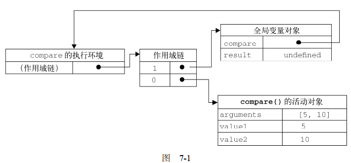
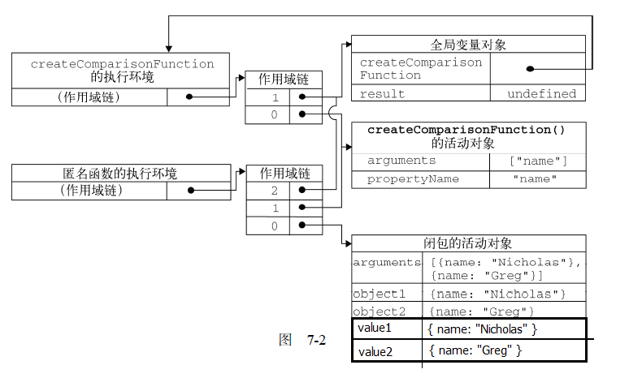

<h1>Javascript执行环境与作用域链小结</h1>

**目录**  
1. [先来分清楚几个让人懵逼的概念](#chapter1)  
2. [再来举个具体的栗子](#chapter2)  
3. [说一下闭包吧](#chapter3)  

<h3 id="chapter1">一、先来分清楚几个让人懵逼的概念</h3>  

1. **【执行环境】**，简称“环境”，有的也翻译为“上下文”。有2个类型： **全局（执行）环境** 和 **局部（执行）环境[即函数]**。环境中的代码全部执行完后，该环境被销毁，所有在该环境中的变量和函数也都会被销毁（全局环境要到程序退出例如关闭网页和浏览器时才会被销毁）。
2. 每个函数都有自己的执行环境，即**局部环境**。当**执行流**进入一个函数（局部环境）时，函数的环境就会被推入一个**环境栈**中。而在函数执行之后，栈将其环境弹出，把控制权返还给之前的执行环境。
3. **【变量对象】**：每一个环境都有一个与之关联的变量对象，环境中定义的所有变量和函数都保存在这个对象中。
4. **【活动对象】**：函数（局部环境）的变量对象就是活动对象。活动对象包含：函数的参数 + 函数中定义的变量和函数声明，最开始时只包含2个变量：arguments对象和this。
5. 全局环境的变量对象始终存在，而局部环境的变量对象（即活动对象）只在函数执行的过程中存在。
6. **【作用域链】**：作用域链本质上是一个**指针列表**，这个列表中的各个指针分别指向各个执行环境的变量对象。  
	> 当代码在一个环境中执行时，会创建变量对象的一个作用域链。作用域链的前端，始终都是当前执行的代码所在环境的变量对象；下一个变量对象来自包含（外部）环境，即【父执行环境】，再下一个变量对象则来自再下一个包含（外部）环境，即【爷执行环境】，这样一直延伸到全局执行环境（全局执行环境的变量对象始终都是作用域链中的最后一个对象）。  
7. **作用域链的作用**是：  
	> 保证对【执行环境有效访问的所有变量和函数】的有序访问。

	- 上面这个句子有2个关键词说明了作用域链的2个具体作用，它们分别是：  
		+ `有效`：当前环境是否有权限访问这个标识符（标识符指的就是变量名或函数名）
		+ `有序`：标识符的解析（变量查找、或者说变量的访问）实际上就是沿着作用域链一级一级地搜索标识符的过程。搜索过程始终从作用域链的前端开始，然后逐级地向后回溯，直至找到标识符为止。（如果找不到标识符，通常会报错）
		+ 另外在上面那2个作用之前，还有一个隐藏作用就是：收集并维护所有声明的标识符
8. **【作用域】**：作用域的形成依据就是作用域链。作用域实际上是一个 **“范围”**，标识符（变量名/函数名）只有在这个 **“范围”** 里面才是有效的、可以访问的。因此，我们平常看到的“变量xxx的作用域”，实际意思就是“变量xxx在代码中的有效（可访问）范围”。
9. 在Javascript中，变量的作用域有2种类型： **全局作用域** 和 **局部作用域** （注意不要和“全局执行环境”、“局部执行环”混淆，它们是两个不同的概念）。  
	我们来举个例子：假设在 **全局执行环境** 中用var定义了一个变量A，那么全局执行环境的 **变量对象** 中就包含了变量A，由于全局执行环境的变量对象在任何作用域链中都位于 **末端** ，这也就是说，不论在代码的什么位置，都可以引用变量A，因此，变量A的作用域（使用范围）是 **全局的** 。  
	在举多个例子：假设在一个函数中（ **局部执行环境** ）用var定义了一个变量B，那么局部执行环境的 **活动对象** 就包含了变量B，由于局部执行环境的活动对象在作用域链中位于 **前端** ，这也就是说，在全局执行环境中，我们无法引用这个函数里面的变量B，因此，变量B的作用域（使用范围）是 **局部的** 。
10. 另外补充一下，使用 **var** 声明的变量会自动被添加到最接近的环境中。在函数内部，最接近的环境就是函数的局部环境。如果在初始化变量时没有使用var声明，该变量会自动被添加到全局环境中。
11. 再另外说一下，Javascript中没有**块级作用域**。

<h3 id="chapter2">二、再来举个具体的栗子</h3>    

<pre>
  function compare(value1, value2) {
	if (value1 < value2) {
	  return -1;
	} else if (value1 > value2) {
	  return 1;
	} else {
	  return 0;
	}
  }

  var resulet = compare(5, 10);
</pre>

上面这个代码，全局执行环境的变量对象包含compare和result。当**调用**compare()时，会为其产生一个局部环境，还会创建一个包含arguments对象、value1、value2（其实还有this）的活动对象。在compare()局部执行环境的作用域链中，compare的活动对象处于第一位，全局环境的变量对象处于第二位。具体看下图：  

  

上面是简单的分析，下面，我们来重新深入分析一下compare()函数这个局部环境的作用域链具体是怎么产生的：  

1. 首先说明一下，全局环境的变量对象始终存在，而像compare()函数这样的局部环境的变量对象（活动对象），只在函数执行的过程中存在。
2. 在**创建**compare()函数时，会创建一个预先包含全局变量对象的**作用域链**，这个作用域链被保存在函数内部的 **[[scope]]属性** 中。
3. 当**调用**compare()函数时，会为函数创建一个 **执行环境（即局部环境）** ，然后复制函数的[[scope]]属性中的的作用域链，作为这个局部环境的作用域链（此时这个局部环境的作用域链里面还只有全局变量对象）。接着，创建这个局部环境的变量对象（即**活动对象**），并把活动对象加入到局部环境的作用域链的前端。至此，这个局部环境的作用域链才完全创建完成。所以，对于这里compare()函数的执行环境而言，其作用域包含两个变量对象：本地活动对象和全局变量对象。

<h3 id="chapter3">三、说一下闭包吧</h3>  

> **闭包**是指有权访问另一个函数作用域中的变量的函数。

也就是说，【闭包】是一个函数，这个函数可以有权访问另一个函数作用域中的变量。

创建闭包的常用方法就是：在一个函数内部创建另一个函数。

为什么要说一下闭包呢？因为闭包和作用域链有着亲密关系。（逃

闭包之所以能够访问上一级函数的变量，就是因为有作用域链的存在。

一般来讲，当函数执行完毕后，局部环境的活动对象就会被销毁，内存中仅保存全局执行环境（全局执行环境的变量对象）。但是，**闭包**的情况又有不同。

> 在另一个函数内部定义的函数会将**其包含函数(外部函数）的活动对象**添加到它的作用域链中。

上面那句话有点拗口，我们举个例子：我们函数A中定义了一个函数B，函数B会把其外部函数（即函数A）的活动对象，加入到自己作用域链中。另外当函数A执行完毕后，函数A的活动对象也不会被销毁，因为函数B的作用域链仍然**引用**着函数A的活动对象，随着函数B的作用域链被销毁，函数A的活动对象才会被销毁。

在举一个更具体的例子吧。

<pre>
  function createComparisonFunction(propertyName) {
    return function(object1, object2) {
      var value1 = object1[propertyName];
      var value2 = object2[propertyName];
	  if (value1 < value2) {
	    return -1;
	  } else if (value1 > value2) {
	    return 1;
	   } else {
	    return 0;
	  }
    };
  }

  //创建函数
  var comparenNames = createComparisonFunction("name");
  //调用函数
  var resule = compareNames({ name:"Nicholas" }, { name:"Greg" });
  //解除对匿名函数的引用
  compareNmaes = null;
</pre>

上面的代码中：  

- 全局执行环境中的变量对象有：comparenNames和resule
- createComparisonFunction()函数的执行环境中的活动对象有：arguments对象和propertyName
- 匿名函数的执行环境中的活动对象有：arguments对象、object1、object2、value1、value2

在调用comparenNames()的过程中产生的作用域链如下图所示：

前面我们说过：
> 标识符的解析（变量查找、或者说变量的访问）实际上就是沿着作用域链一级一级地搜索标识符的过程。搜索过程始终从作用域链的前端开始，然后逐级地向后回溯，直至找到标识符为止

根据上图的作用域链，所以有：  
匿名函数可以访问其自身本地变量、createComparisonFunction()中的变量和全局环境中的变量；  
createComparisonFunction()只能访问其自身本地变量和全局环境中的变量，不能访问匿名函数中的变量；  
全局环境中，只能访问全局环境中的变量，不能访问createComparisonFunction()中的变量和匿名函数中的变量。

