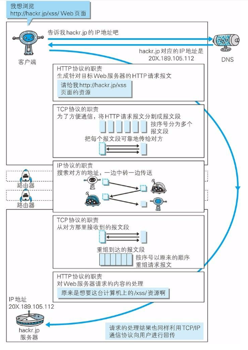

这是文章摘要
<!--more-->

<h1>《图解HTTP》读书笔记（持续更新中）</h1>

<h4>目录</h4>

1. [第一章 了解Web及其网络基础](#chapter1)
2. [第二章 简单的HTTP协议](#chapter2)
3. [第三章 HTTP报文内的HTTP信息](#chapter3)
4. [第四章 返回结果的HTTP状态码](#chapter4)
5. [第五章 与HTTP协作的Web服务器](#chapter5)
6. [第六章 HTTP首部](#chapter6)
7. [第七章 确保Web安全的HTTPS](#chapter7)
8. [第八章 确认访问用户身份的认证](#chapter8)
9. [第九章 基于HTTP功能追加协议](#chapter9)
10. [第十章 构建Web内容的技术](#chapter10)
11. [第十一章 Web的攻击技术](#chapter11)

<h3 id="chapter1">第一章 了解Web及其网络基础</h3>

1. **TCP/IP协议族**
    - 什么是TCP/IP？  
    	按照[Wiki](https://zh.wikipedia.org/wiki/TCP/IP%E5%8D%8F%E8%AE%AE%E6%97%8F)的介绍：  
    	> **TCP/IP协议族** 是互联网相关联的各类协议的总称，简称 **TCP/IP** 。这样叫是因为因为该协议家族的两个核心协议： **TCP（传输控制协议）** 和 **IP（网际协议）** ，为该家族中最早通过的标准。
    - TCP/IP的分层管理  
    	TCP/IP协议族按层次分为4层：应用层，传输称，网络层，数据链路层。  
		*  **应用层**   
		应用层决定了向用户提供应用服务时的通信活动。  
		在这层中常用的协议有：   
		**FTP（File Transfer Protocol，文件传输协议）**  
		**DNS（Domain Name System，域名系统）**  
		**HTTP协议**   

		*  **传输层**   
		传输层的作用是：对应用层提供处于网络连接中的两台计算机之间的数据传输。  
		在这里层中有两个性质不同的协议：   
		**TCP（Transmission Control Protocol， 传输控制协议）**  
		**UDP（User Data Protocol，用户数据报协议）**  

		*  **网络层（网络互联层）**   
		网络层用来处理网络上流动的数据包（数据包是网络传输的最小的数据单位）。该层规定了通过怎样的路径到达对方计算机，并把数据包传给对方。（即为数据包选择一条合适的传输路径）。  
		在这层中常用的协议有：  
		IP协议  

		*  **链路层（数据链路层，网络接口层）**  
		链路层用来处理连接网络的硬件部分。硬件上的范畴均在链路层的作用范围之内。  
    - TCP/IP的通信传输流   
    	  

		

2. **与HTTP协议关系密切的协议：IP协议、TCP协议、DNS协议**
	- IP协议负责传输  
	> IP是在TCP/IP协议中网络层的主要协议，任务是仅仅 **根据源主机和目的主机的地址传送数据** 。为此目的，IP定义了寻址方法和数据报的封装结构。第一个架构的主要版本，现在称为IPv4，仍然是最主要的互联网协议，尽管世界各地正在积极部署IPv6。（来自wiki）  
	
	也就是说IP协议的作用是把各种数据包传送给对方。而要保证确实传送到对方那里，而需要满足各类条件。其中两个重要的条件是IP地址和MAC地址。IP地址指明了节点被分配到的地址。MAC地址是指网卡所属的固定地址。IP地址可以和MAC地址进行配对。IP地址可以变换，但MAC地址基本上不会改变。
	- TCP协议确保可靠性  
	TCP协议为了更容易传送大数据才把数据分割，而且TCP协议能够确认数据最终是否送达到对方（可靠性的体现）。  
	 **确保数据能到达目标** 的方法就是著名的TCP **三次握手** 策略：  
	（握手过程中使用了TCP的标志——SYN（synchronize，同时发生）、ACK（acknowledgement，承认确认）  
	（第一次握手）发送端首先发送一个带 **SYN标志** 的数据包给对方。  
	（第二次握手）接收端接收到后，回传一个带有 **SYN/ACK** 标志的数据包以示传达确认信息。  
	（第三次握手）最后，发送端再回传一个带 **ACK标志** 的数据包，代表“握手”结束。  

	
	- DNS协议负责域名解析  
	DNS提供域名到IP地址之间的解析服务。有了DNS，就可以通过域名查找IP地址，或者通过IP地址反查域名的服务。

3. **HTTP协议和其他各种协议的关系**
	

4. **URI和URL**
	- 概念  
	URI全名叫：统一资源标识符  
	URL全名叫：统一资源定位符  
	URI用字符串表示某一互联网资源，而URL表示资源的地点（互联网上所处的位置）。可见URL是URI的子集。
	- 绝对URI的格式  
	
5. **一句话概括HTTP协议是什么**
	> HTTP协议（超文本传输协议）是一种发送和接收HTML页面的规则（方法）。 

<h3 id="chapter2">第二章 简单的HTTP协议</h3>  
（填坑中......）

<h3 id="chapter3">第三章 HTTP报文内的HTTP信息</h3>  
（填坑中......）

<h3 id="chapter4">第四章 返回结果的HTTP状态码</h3>  
（填坑中......）

<h3 id="chapter5">第五章 与HTTP协作的Web服务器</h3>  
（填坑中......）

<h3 id="chapter6">第六章 HTTP首部</h3>  
（填坑中......）

<h3 id="chapter7">第七章 确保Web安全的HTTPS</h3>  
（填坑中......）

<h3 id="chapter8">第八章 确认访问用户身份的认证</h3>  
（填坑中......）

<h3 id="chapter9">第九章 基于HTTP功能追加协议</h3>  
（填坑中......）

<h3 id="chapter10">第十章 构建Web内容的技术</h3>  
（填坑中......）

<h3 id="chapter11">第十一章 Web的攻击技术</h3>  
（填坑中......）

